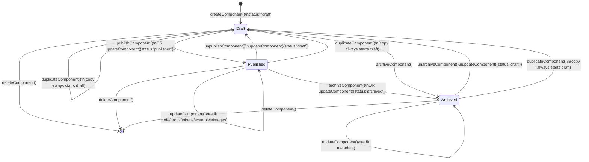
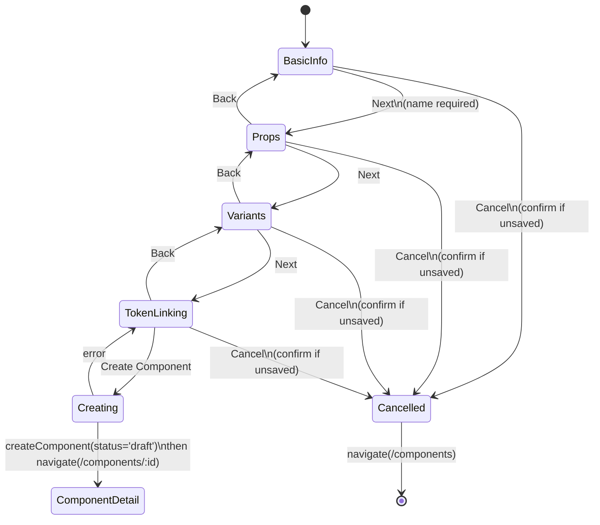
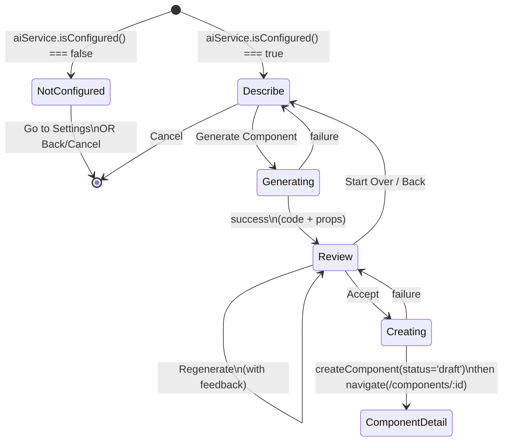
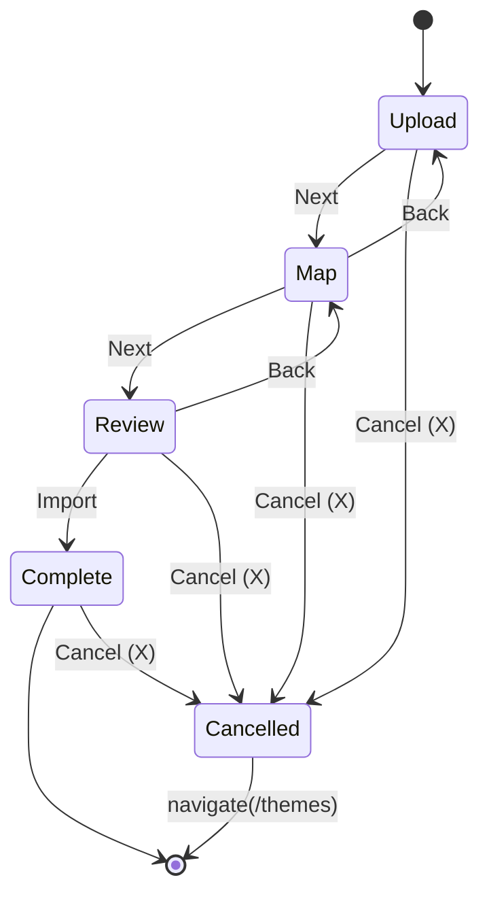
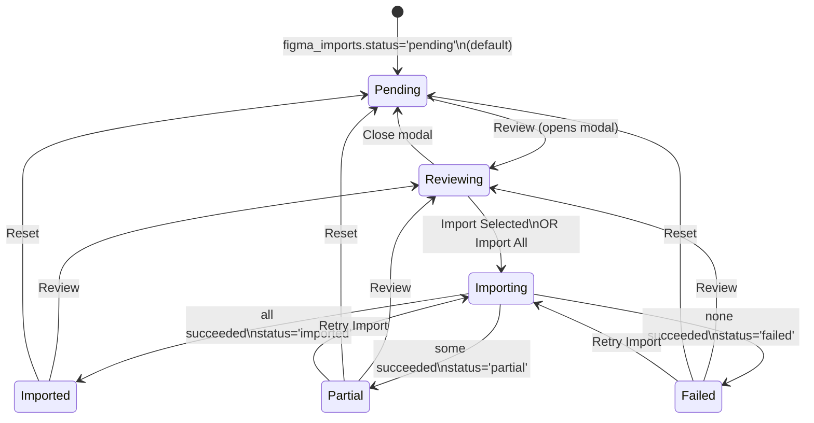
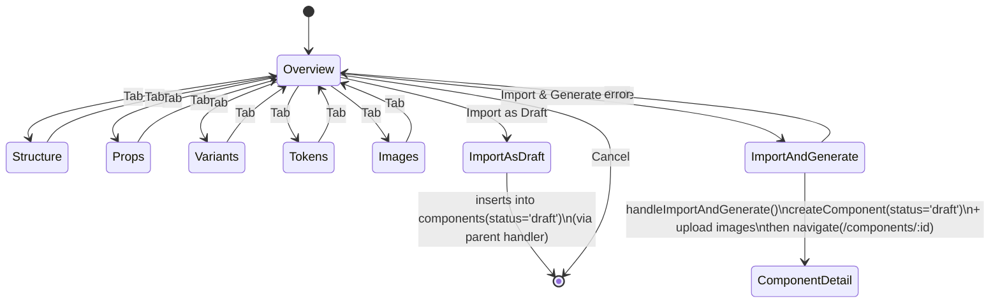
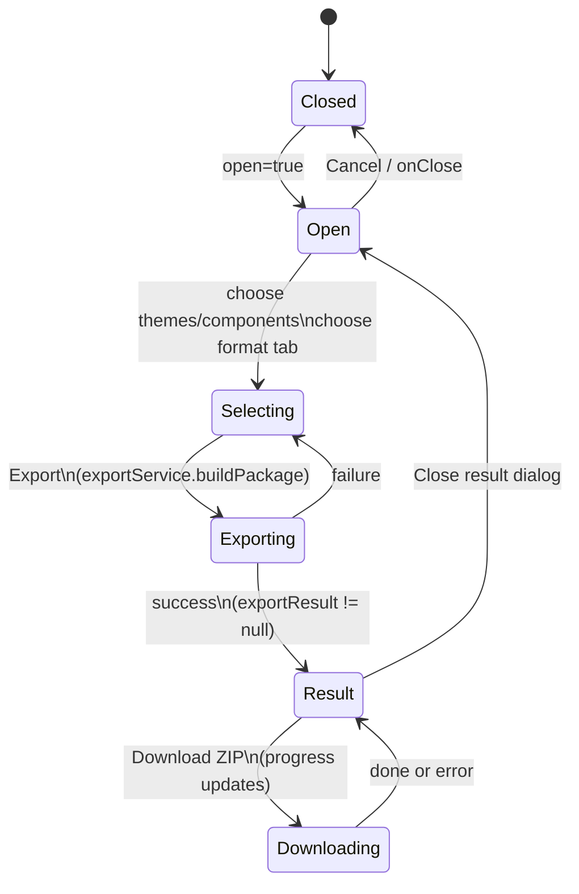

# Component state machine diagrams (current implementation)

These diagrams reflect the **state machines that exist in the code today** for “components” in this repo:

- **Design Components (DB records)**: Supabase `components` table records managed via `componentService`.
- **Figma Imports (DB records)**: Supabase `figma_imports` + `figma_import_components` records reviewed then imported into `components`.
- **Wizard / flow components (UI)**: Multi-step UIs that move between well-defined steps.

---

## Design component lifecycle (`components.status`)

Source of truth:
- `src/services/componentService.js`
- `src/components/components/ComponentCard.jsx`
- `src/pages/ComponentDetailPage.jsx`

---

## Manual component creation wizard (UI)

Source of truth:
- `src/components/components/wizard/ManualCreationWizard.jsx`
- `src/components/components/wizard/steps/BasicInfoStep.jsx`
- `src/components/components/wizard/steps/PropsStep.jsx`
- `src/components/components/wizard/steps/VariantsStep.jsx`
- `src/components/components/wizard/steps/TokenLinkingStep.jsx`

---

## AI component generation flow (UI + service)

Source of truth:
- `src/components/components/ai/AIGenerationFlow.jsx`
- `src/services/aiService.js`

---

## Theme import wizard (tokens/theme data) (UI)

Source of truth:
- `src/components/themes/import/ImportWizard.jsx`
- `src/components/themes/import/UploadStep.jsx`
- `src/components/themes/import/MappingStep.jsx`
- `src/components/themes/import/ReviewStep.jsx`
- `src/components/themes/import/CompleteStep.jsx`

---

## Figma import record lifecycle (`figma_imports.status`)

Source of truth:
- `src/pages/FigmaImportPage.jsx`
- `src/hooks/useFigmaImport.js`
- `src/components/figma-import/ImportReviewCard.jsx`

---

## Figma component review/import modal (UI)

Source of truth:
- `src/components/figma-import/ImportReviewModal.jsx`
- `src/components/figma-import/GenerateFromFigma.jsx`

---

## Export flow (UI)

Source of truth:
- `src/components/export/ExportModal.jsx`
- `src/services/exportService.js`
- `src/components/export/ExportResultDialog.jsx`

